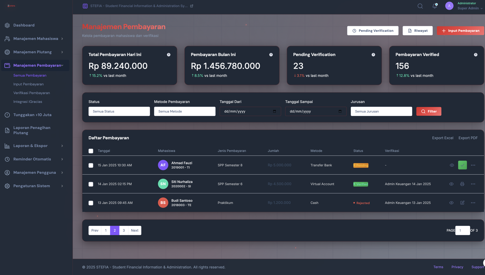
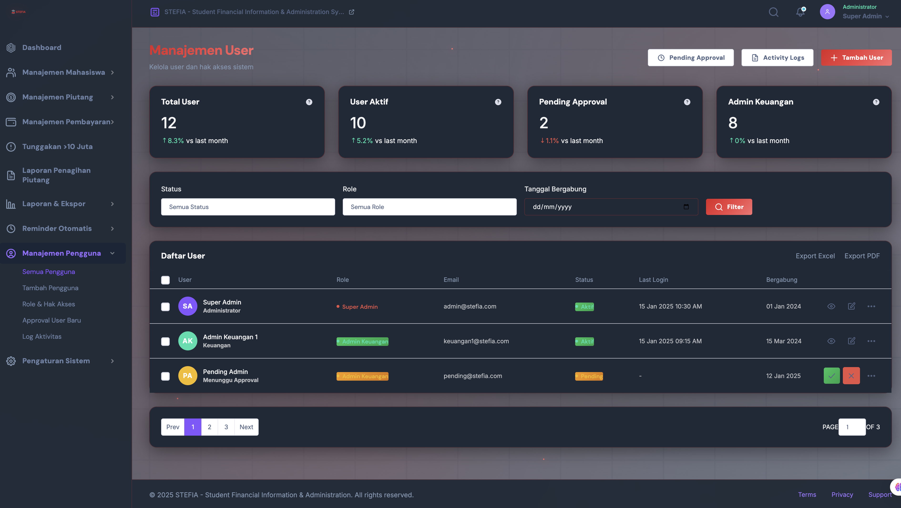

## Table of Contents
1. Introduction
2. Landing Page
3. Dashboard Overview
4. Menu Descriptions
   - Student Management
   - Debt Management
   - Payment Management
   - Collection Report
   - User Management
   - System Settings
5. Detailed Feature Explanations
   - Notifications
   - Export Options
   - User Roles
6. User Interface Overview
   - Navigation
   - Visual Design
   - Responsive Design
7. Export Options and Reporting
   - PDF/Excel Export
   - Reporting
8. System Requirements
9. Support and Feedback
10. Appendix: Image References

---

## 1. Introduction

Welcome to the STEFIA Application Manual. This document provides a comprehensive guide to help you utilize the application to its fullest potential, covering everything from the landing page to advanced features. 

## 2. Landing Page

The landing page serves as the entry point to the application, providing a modern and engaging user interface with links to login and support.

## 3. Dashboard Overview

The dashboard is your central command center, offering real-time insights into key financial metrics.
- **Summary Cards**: View critical statistics like total receivables, active accounts, and overdue payments at a glance.
- **Interactive Graphs**: Analyze financial trends with dynamic charts for receivables, payments, and student enrollment.
- **Notifications**: Stay informed with timely alerts and system updates.

## 4. Menu Descriptions

### Student Management
Manage student-related tasks seamlessly:
- **View and Edit Student Information**: Access a complete list of students with advanced search and filtering options.
- **Import Data**: Bulk import student records from CSV or Excel files.
- **Integration**: Sync with external systems to ensure data consistency.

### Debt Management
Track and manage all student debts, with a focus on:
- **Outstanding Balances**: Monitor overdue payments and manage critical debts.
- **Historical Records**: View detailed debt history for each student.
- **Export Options**: Export debt reports in PDF or Excel for further analysis.

### Payment Management
Streamline payment processing and verification:
- **Record New Payments**: Log payments with detailed transaction information.
- **Verify Pending Payments**: Approve or reject payments with comprehensive audit trails.
- **Payment History**: Access complete payment records for reconciliation.

### Collection Report
Generate detailed collection reports to track financial performance:
- **Action Tracking**: Monitor follow-up actions and communications with students.
- **Export Reports**: Generate reports in multiple formats for internal and external stakeholders.
- **Customizable Filters**: Narrow down data based on specific criteria like date ranges and payment status.

### User Management
Administer user access and roles:
- **Create and Assign Roles**: Control user permissions to ensure data security.
- **View Activity Logs**: Monitor user actions for audit and compliance purposes.
- **Approve New Users**: Manage user registration and access requests.

### System Settings
Configure system-wide settings to match your organization's needs:
- **General Configuration**: Customize application settings like currency and branding.
- **Integration Setup**: Manage connections with external platforms.
- **Backup and Restore**: Ensure data integrity with regular backups and recovery options.

## 5. Detailed Feature Explanations

### Notifications
Receive real-time alerts for important events such as overdue payments, new user registrations, and system updates.

### Export Options
Export data in PDF and Excel formats for offline analysis, reporting, and compliance.

### User Roles
Assign roles to users to control access to sensitive information and features:
- **Admin**: Full control over all system functionalities.
- **Finance Officer**: Access to financial data, reporting, and payment management.
- **Student Advisor**: Limited access to student records and academic information.

## 6. User Interface Overview

### Navigation
A user-friendly sidebar provides easy access to all modules and features.

### Visual Design
A consistent and modern design with gradient backgrounds, smooth animations, and a responsive layout enhances user experience.

### Responsive Design
The application is fully responsive and adapts to various screen sizes, ensuring a seamless experience on desktops, tablets, and mobile devices.

## 7. Export Options and Reporting

### PDF/Excel Export
Generate professional-looking reports and export data for further analysis.

### Reporting
Utilize advanced reporting tools to gain insights into financial health and operational efficiency.

## 8. System Requirements

- **Web Browser**: Latest version of Chrome, Firefox, or Edge.
- **RAM**: Minimum 4GB.
- **Internet Connection**: Stable and high-speed internet access.

## 9. Support and Feedback

For assistance, please contact our support team at support@stefiaapp.com or visit our [support page](support.stefiaapp.com).

## 10. Appendix: Image References

- All images in this manual are actual screenshots from the application to provide clear and accurate guidance.
- Annotations are provided where necessary to highlight key features and functionalities.

## Table of Contents
1. Introduction
2. Landing Page
3. Dashboard Overview
4. Menu Descriptions
   - Student Management
   - Debt Management
   - Payment Management
   - Collection Report
   - User Management
   - System Settings
5. Detailed Feature Explanations
6. User Interface Overview
7. Export Options and Reporting
8. System Requirements
9. Support and Feedback

---

## 1. Introduction

Welcome to the STEFIA Application Manual. This document will guide you through the features, functionalities, and usage of the STEFIA application designed to manage student financial information efficiently.

## 2. Landing Page

The landing page provides a brief overview of the application with links to login for registered users or to contact support. It features a modern layout with animations to enhance user engagement.

## 3. Dashboard Overview

The dashboard is the central hub for all financial transactions, displaying real-time statistics such as total receivables, active and overdue accounts, and more. It incorporates:
- Summary Cards
- Interactive Graphs
- Notifications

## 4. Menu Descriptions

### Student Management
Manage all student-related tasks, including:
- Viewing and editing student information
- Importing data
- Integrations with external systems

### Debt Management
Track all student debts, focusing on:
- Outstanding balances
- Critical debts above 10 million
- Historical records and actions

### Payment Management
Process and verify payments:
- Record new payments
- Verify pending payments
- Check payment history

### Collection Report
Generate detailed reports tracking:
- Actions taken by finance
- Student obligations and follow-ups
- Export reports in Excel or PDF

### User Management
Manage users within the system:
- Create and assign roles
- View activity logs
- Approve or reject new users

### System Settings
Configure system-wide settings, including:
- General configurations
- Integration setup
- Backup and restore options

## 5. Detailed Feature Explanations
- **Notifications**: Keeps the user informed with the latest updates and reminders.
- **Export Options**: Allows export of data in formats such as PDF and Excel.
- **User Roles**: Role-based access for enhanced security.

## 6. User Interface Overview

### Navigation
Smooth navigation is achieved through a sidebar menu providing quick access to different sections.

### Visual Design
A consistent theme is maintained across the application with gradient backgrounds and smooth animations providing a cohesive look.

## 7. Export Options and Reporting

Easily export data:
- Export collection reports and student debts to PDF and Excel.

## 8. System Requirements

Ensure your system meets the following requirements:
- Modern web browser
- Internet access
- Proper server configuration for hosting

## 9. Support and Feedback

For support or feedback, please contact our support team at support@stefiaapp.com.

---

Thank you for choosing STEFIA. This manual serves as a comprehensive guide to ensure you can utilize the application to its fullest potential.
