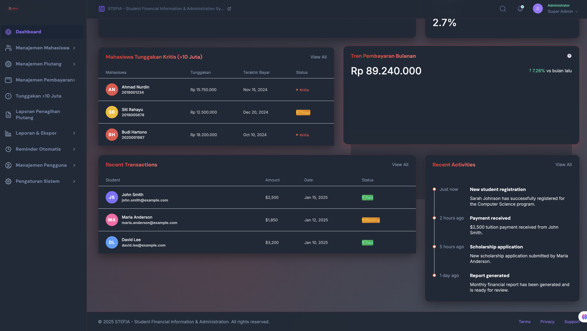
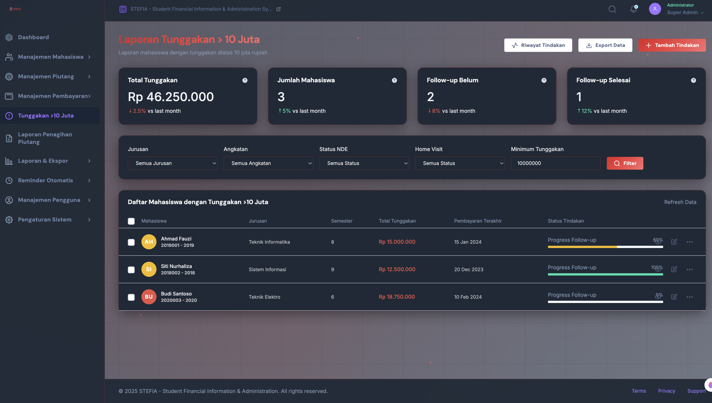

# STEFIA Application - Complete User Manual

## Table of Contents
1. [Introduction](#introduction)
2. [Landing Page](#landing-page)
3. [Authentication & Login](#authentication--login)
4. [Dashboard Overview](#dashboard-overview)
5. [Menu Descriptions](#menu-descriptions)
   - [Student Management](#student-management)
   - [Debt Management](#debt-management)
   - [Payment Management](#payment-management)
   - [Tunggakan >10 Juta](#tunggakan-10-juta)
   - [Collection Report](#collection-report)
   - [Reports & Export](#reports--export)
   - [Reminders](#reminders)
   - [User Management](#user-management)
   - [System Settings](#system-settings)
6. [Detailed Feature Explanations](#detailed-feature-explanations)
7. [User Interface Overview](#user-interface-overview)
8. [Export Options and Reporting](#export-options-and-reporting)
9. [System Requirements](#system-requirements)
10. [Support and Feedback](#support-and-feedback)

---

## 1. Introduction

Welcome to the STEFIA (Student Financial Information & Administration) Application Manual. This comprehensive guide will help you navigate through all features and functionalities of the application designed to streamline student financial management processes.

**Key Features:**
- Real-time financial tracking
- Student debt management
- Payment processing and verification
- Collection reporting
- User role management
- Export and reporting capabilities

---

## 2. Landing Page

The landing page serves as the entry point to the STEFIA application, featuring:

**Components:**
- **Header Navigation**: Links to login and support
- **Hero Section**: Introduction to STEFIA with key benefits
- **Feature Highlights**: Core functionalities overview
- **Call-to-Action**: Login button for registered users
- **Footer**: Contact information and additional resources

**Visual Elements:**
- Modern gradient background with animated particles
- Responsive design for all devices
- Smooth animations and transitions
- Professional typography and color scheme

---

## 3. Authentication & Login

**Login Process:**
1. Click "Login" from the landing page
2. Enter your credentials (username/email and password)
3. Click "Sign In" to access the dashboard

**Features:**
- Secure authentication
- Password recovery option
- Remember me functionality
- Role-based access control

---

## 4. Dashboard Overview

The dashboard is your central command center, providing comprehensive insights into financial data and operations.

**Key Components:**

### Summary Cards
- **Total Students**: Current student count
- **Total Receivables**: Outstanding amounts
- **Active Receivables**: Current active debts
- **Paid Receivables**: Completed payments
- **Overdue Receivables**: Past due amounts
- **Critical Debts**: High-value outstanding debts
- **Today's Payments**: Daily payment activity
- **Collection Rate**: Recovery percentage

### Interactive Charts
- **Payment Trends**: Monthly payment analysis
- **Receivable Status**: Pie chart showing payment distribution
- **Financial Overview**: Area chart for trend analysis

### Recent Activities
- Latest payment transactions
- New student registrations
- System notifications
- Critical debt alerts

---

## 5. Menu Descriptions

### Student Management

**Functionalities:**
- **View All Students**: Comprehensive student list with search and filter options
- **Add New Student**: Registration form with academic and personal details
- **Import Data**: Bulk upload from CSV/Excel files
- **iGracias Integration**: Sync with external academic systems

**Features:**
- Advanced search capabilities
- Bulk operations
- Data validation
- Export options

**Navigation Path:** `Dashboard > Student Management`

### Debt Management

**Core Functions:**
- **All Receivables**: Complete debt overview
- **Outstanding Debts**: Unpaid amounts tracking
- **Debt History**: Historical payment records
- **Bulk Updates**: Mass debt modifications

**Key Features:**
- Real-time debt calculations
- Automated aging reports
- Payment schedule management
- Integration with payment systems

### Payment Management

**Primary Functions:**
- **Record Payments**: Manual payment entry
- **Verify Payments**: Approval workflow
- **Payment History**: Complete transaction records
- **iGracias Integration**: Automated payment sync

**Capabilities:**
- Multiple payment methods support
- Automated receipt generation
- Payment validation
- Audit trail maintenance

### Tunggakan >10 Juta

**Purpose:** Focus on students with critical debt levels above 10 million IDR

**Features:**
- **Critical Debt List**: Students with high outstanding amounts
- **Action Tracking**: Follow-up activities monitoring
- **Status Updates**: Progress tracking for each case
- **Export Options**: PDF and Excel reports

**Action Types:**
- NDE (Tidak Diperkenankan Evaluasi) status
- Dosen Wali collaboration
- Parent notification letters
- Phone contact attempts
- Home visits

### Collection Report

**Comprehensive Collection Management:**
- **Student Information**: NIM, name, department, faculty
- **Academic Details**: Current semester, academic year
- **Debt Information**: Outstanding amounts, overdue semesters
- **Action Tracking**: All collection activities
- **Status Monitoring**: Student status (active/inactive/leave)

**Action Management:**
- **NDE Fakultas**: Faculty-level restrictions
- **Dosen Wali Cooperation**: Academic advisor involvement
- **Parent Correspondence**: Family communication
- **Phone Contacts**: Direct communication attempts
- **Home Visits**: Physical visit arrangements

**Reporting Features:**
- Customizable filters (faculty, department, debt range)
- Export to Excel/PDF
- Action history timeline
- Progress tracking

### Reports & Export

**Report Types:**
- **Monthly Reports**: Regular financial summaries
- **Financial Reports**: Comprehensive financial analysis
- **Student Reports**: Academic and financial combined data
- **Export Data**: Bulk data extraction

**Export Formats:**
- PDF for formal reports
- Excel for data analysis
- CSV for system integration

### Reminders

**Automated Communication:**
- **Email Reminders**: Scheduled email notifications
- **WhatsApp Reminders**: Mobile messaging integration
- **Reminder Scheduling**: Custom timing setup
- **Message Templates**: Pre-configured messages

### User Management

**User Administration:**
- **User Accounts**: Create, modify, deactivate users
- **Role Assignment**: Define user permissions
- **Activity Logs**: Monitor user actions
- **Approval Workflow**: New user verification

**Role Types:**
- **Admin**: Full system access
- **Finance Officer**: Financial data access
- **Student Advisor**: Student records access
- **Viewer**: Read-only access

### System Settings

**Configuration Options:**
- **General Settings**: Application preferences
- **Integration Setup**: External system connections
- **Backup & Restore**: Data management
- **Security Settings**: Access control configuration

---

## 6. Detailed Feature Explanations

### Notifications System
- **Real-time Alerts**: Instant notifications for critical events
- **Email Notifications**: Automated email alerts
- **Dashboard Alerts**: In-app notification center
- **Mobile Notifications**: Push notifications for mobile users

### Export Capabilities
- **PDF Generation**: Professional report formatting
- **Excel Export**: Data analysis-friendly format
- **CSV Export**: System integration compatible
- **Custom Reports**: Tailored reporting options

### User Role Management
- **Hierarchical Permissions**: Multi-level access control
- **Department-based Access**: Departmental data isolation
- **Audit Trail**: Complete user activity logging
- **Session Management**: Secure session handling

### Data Integration
- **iGracias Integration**: Academic system synchronization
- **API Support**: External system connectivity
- **Data Validation**: Automated data integrity checks
- **Backup Systems**: Regular data backups

---

## 7. User Interface Overview

### Navigation Structure
- **Sidebar Menu**: Main navigation panel
- **Breadcrumb Navigation**: Current location indicator
- **Quick Actions**: Frequently used functions
- **Search Functionality**: Global search capability

### Visual Design Elements
- **Color Scheme**: Red-to-pink gradient theme
- **Typography**: Clear, readable fonts
- **Iconography**: Intuitive icons throughout
- **Animations**: Smooth transitions and effects

### Responsive Design
- **Desktop Optimization**: Full-featured interface
- **Tablet Compatibility**: Touch-friendly interactions
- **Mobile Responsive**: Essential features on mobile
- **Cross-browser Support**: Works on all major browsers

---

## 8. Export Options and Reporting

### Export Formats
- **PDF Reports**: Professional presentation format
- **Excel Spreadsheets**: Data analysis and manipulation
- **CSV Files**: System integration and data migration

### Report Categories
- **Financial Reports**: Revenue, outstanding, and payment analysis
- **Student Reports**: Academic and financial combined data
- **Collection Reports**: Debt recovery and action tracking
- **Administrative Reports**: User activity and system usage

### Customization Options
- **Date Range Selection**: Flexible reporting periods
- **Filter Options**: Department, faculty, student status
- **Data Grouping**: Organize data by various criteria
- **Format Templates**: Pre-designed report layouts

---

## 9. System Requirements

### Minimum Requirements
- **Operating System**: Windows 10, macOS 10.14, or Linux
- **Web Browser**: Chrome 90+, Firefox 88+, Safari 14+, Edge 90+
- **RAM**: 4GB minimum, 8GB recommended
- **Internet Connection**: Stable broadband connection
- **Screen Resolution**: 1280x720 minimum, 1920x1080 recommended

### Recommended Specifications
- **RAM**: 8GB or more
- **Internet Speed**: 10 Mbps or faster
- **Screen Size**: 15 inches or larger
- **Browser**: Latest version of Chrome or Firefox

### Network Requirements
- **Bandwidth**: Minimum 1 Mbps for basic operations
- **Latency**: Less than 100ms for optimal performance
- **Firewall**: Allow HTTPS connections on port 443
- **Security**: SSL/TLS encryption support

---

## 10. Support and Feedback

### Getting Help
- **Email Support**: support@stefiaapp.com
- **Support Portal**: [support.stefiaapp.com](https://support.stefiaapp.com)
- **Documentation**: Complete user guides and tutorials
- **Video Tutorials**: Step-by-step video instructions

### Feedback Channels
- **Feature Requests**: Submit suggestions for new features
- **Bug Reports**: Report issues or problems
- **User Surveys**: Periodic feedback collection
- **Community Forum**: User discussion and tips

### Training Resources
- **User Manual**: This comprehensive guide
- **Video Tutorials**: Visual learning materials
- **Webinar Sessions**: Live training sessions
- **Best Practices**: Recommended usage patterns

### Contact Information
- **Technical Support**: tech-support@stefiaapp.com
- **Sales Inquiries**: sales@stefiaapp.com
- **General Information**: info@stefiaapp.com
- **Phone Support**: Available during business hours

---

## Quick Reference Guide

### Common Tasks
1. **Add New Student**: Student Management > Add New
2. **Record Payment**: Payment Management > Record Payment
3. **View Outstanding Debts**: Debt Management > Outstanding
4. **Generate Report**: Reports & Export > Select Report Type
5. **Export Data**: Choose module > Export button > Select format

### Keyboard Shortcuts
- **Ctrl + S**: Save current form
- **Ctrl + F**: Search within current page
- **Ctrl + E**: Export current view
- **Ctrl + R**: Refresh data
- **Ctrl + H**: Go to Dashboard

### Important Notes
- Always log out when finished to maintain security
- Regular data backups are performed automatically
- Report any suspicious activities immediately
- Keep login credentials secure and confidential

---

*This manual is regularly updated to reflect the latest features and improvements. For the most current version, please visit the support portal.*

**Document Version:** 1.0  
**Last Updated:** January 2025  
**Next Review:** March 2025
